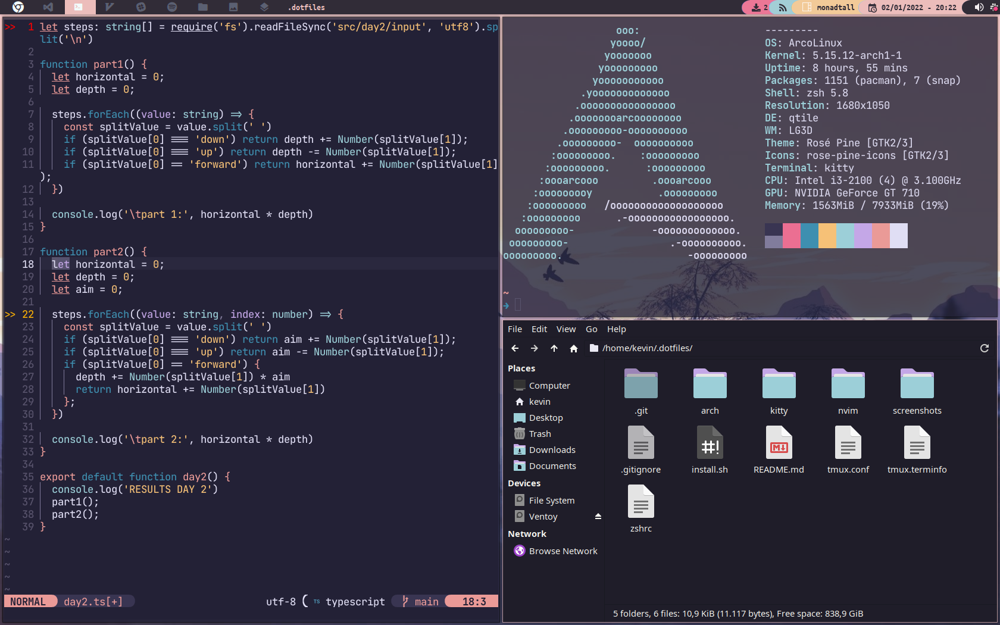

# Qtile Config

- Theme: [Rose Pine](https://github.com/rose-pine)

## screenshot

## Keybindings

| Key                     | Action                           |
| ----------------------- | -------------------------------- |
| **mod + j**             | next window (down)               |
| **mod + k**             | next window (up)                 |
| **mod + shift + h**     | decrease master                  |
| **mod + shift + l**     | increase master                  |
| **mod + shift + j**     | move window down                 |
| **mod + shift + k**     | move window up                   |
| **mod + shift + f**     | toggle floating                  |
| **mod + tab**           | change layout                    |
| **mod + [1-9]**         | Switch to workspace N (1-9)      |
| **mod + shift + [1-9]** | Send Window to workspace N (1-9) |
| **mod + period**        | Focus next monitor               |
| **mod + comma**         | Focus previous monitor           |
| **mod + w**             | kill window                      |
| **mod + ctrl + r**      | restart wm                       |
| **mod + ctrl + q**      | quit                             |
| **mod + space**         | launch rofi                      |
| **mod + shift + space** | window nav (rofi)                |
| **mod + b**             | launch browser (Google Chrome)   |
| **mod + e**             | launch file explorer (thunar)    |
| **mod + return**        | launch terminal (kitty)          |
| **mod + r**             | redshift                         |
| **mod + shift + r**     | stop redshift                    |
| **mod + s**             | screenshot (scrot)               |

Config based in [Antonio Sorosi](https://github.com/antoniosarosi/dotfiles)
